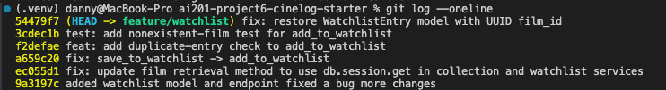

# PR Response Doc — CineLog Watchlist Feature

## AI Usage
<!-- Fill in at the end — how you used AI tools during this project -->

A specific way I used my AI tool Claude was during comment 1 and I needed to find all the references to the old function name for add_to_watchlist() and got Claude to search the whole dataflow and list all the missed names. Futhermore, for
comments 4 and 5 it was especially helpful to use claude because I can ask it to break my reponses in a logical manner like a senior dev would to a junior dev. This process was used to solidify my choices and reasons for choosing to do so.

## Comment 1 — Rename
**What I did:** 
Changed the name of save_to_watchlist() to add_to_watchlist() in watchlist_services.py and watchlist.py
**How I verified:** 
Asked claude where save_to_watchlist was referenced in the repo and checked again after changing the name. It returned watchlist_service.py and watchlist.py
## Comment 2 — Deduplication
**What I did:** 
Copied the deduplication check from add_to_collection()in collection_service.py. Pasted into watchlist_service.py and created AlreadyInWatchlistError to use in the deduplication in add_to_watchlist(). Changed Existing in the deduplication from referencing CollectionEntry to WatchlistEntry.
**How I verified:**
Asked claude to verify the new error and deduplication. Used a throwaway script to test by adding the same film and it returned the appropriate error message
## Comment 3 — Missing test
**What I did:** 
Created the test_watchlist.py file in the tests folder and imported the appropriate apps, models and the FilmNotFound error , add_to_watchlist function from watchlist_service.py. Copied the pytest fixture for app, sample_user and sample_film into the test_watchlist.py file. Copied test_add_to_collection_nonexistent_film_raises and renamed into test_add_to_watchlist_nonexistent_film_raises and called add_to_watchlist instead of add_to_collection()
**How I verified:**
Ran the pytest for test_add_to_watchlist_nonexistent_film_raises and passed,futhermore claude reaffirms test_add_to_watchlist_nonexistent_film_raises is a working port of the collection test pattern
## Comment 4 — Default visibility
**My position:** 
From not purely a computer science standpoint but also a cybersecurity standpoint, Default visibility should not be public. It should be private with an option to make it public for users who decide to show their watchlist to the general public. This would be comfortable for people who just want a personal and private watchlist
**Reasoning:**
A Public watchlist for every user means privacy is not enforced by default, so other users will  possibly not want to use the app for privacy concerns.  Currently Get /watchlist/<user_id> returns a watchlist based only on user_id so also implementing authentication on the endpoint will help improve privacy
**Tradeoff acknowledged:**
The tradeoff with default private is the social aspect for the cinelog app because users will have to give each person permission to view their watchlist.
## Comment 5 — Sort order
**My position:**
I believe that date-added with newest first should be the default for watchlists with a option to sort alphabetically to find specific films.
**Reasoning:**
Not only is it more convenient for the user to find a film that they recently added, it also helps the user remind themselves of where they left off based on recency.
**Engagement with reviewer's point:**
I agree with your view on having "date added" as default because of recency helping viewers continuing where they left off .On the other hand we will have to update get_watchlist() in watchlist_service.py because it is currently sorted by title in ascending order.
## Comment 6 — Rebase
**What conflicted:**
Two different things are conflicting,Film.id changed from integer id's to UUID,aswell the WatchlistEntry class from models.py was deleted leading to watchlist_service.py and test_watchlist.py to not work
**How I resolved it:**
I copied the WatchlistEntry class from the feature/watchlist branch and pasted it back into models.py near the bottom. I also copied the Film description from add_to_collection() and replaced the integer description in add_to_watchlist(). Also copied the the film_id from collectionEntry in models.py into watchlistEntry to update film_id to uuid from integer.
**How I verified no conflict remains:**
I asked claude to run a check on mentions of integer ids in the watchlist dataflow while also conducting a script test. Also comparing the code from collectionEntry and checklistEntry because they are almost identical on the database side
## PR Description

**Feature overview**

Adds a watchlist feature to CineLog: a place for users to save films they *intend* to watch, distinct from the existing collection feature (films already watched). Two new endpoints:

- `POST /watchlist/<user_id>/add` — add a film to a user's watchlist. Body: `{ "film_id": "<uuid>" }`.
- `GET /watchlist/<user_id>` — return all films on a user's watchlist.

Business logic lives in `services/watchlist_service.py`, mirroring the patterns already established by `collection_service.py`: `add_to_watchlist()` raises `FilmNotFoundError` if the film doesn't exist, and now raises `AlreadyInWatchlistError` if it's already on the user's watchlist (Comment 2), so the same film can't be added twice.

**Design decisions**

1. **Default visibility (Comment 4):** `WatchlistEntry.public` should default to private, not public. The behavior being optimized for is letting users log films they want to watch without worrying that list is exposed by default — sharing should be something a user opts into, not something they have to opt out of. The acknowledged tradeoff is losing frictionless social discovery (friends seeing your watchlist automatically); users would need to be granted view access explicitly. *Note: the schema currently still defaults `public=True` — this is the recommended follow-up, not yet applied to `models.py`.*

2. **Sort order (Comment 5):** `get_watchlist()` should sort by `date_added`, newest first (matching `get_collection()`'s existing `date_added.desc()` convention), with alphabetical-by-title available as a secondary option for users looking for a specific film. This optimizes for recency — picking up where you left off — over alphabetical scanning. *Note: `get_watchlist()` currently still sorts by `Film.title.asc()` — also a pending follow-up, not yet applied to `services/watchlist_service.py`.*

**Manual testing steps**

1. Start the app: `flask --app app run` (or run via your usual entrypoint).
2. Create a user and a film (via the existing films/user setup — no dedicated endpoints exist yet, so seed via a script or the Flask shell) and note their UUIDs.
3. Add a film to the watchlist:
   `curl -X POST http://localhost:5000/watchlist/<user_id>/add -H "Content-Type: application/json" -d '{"film_id": "<film_id>"}'`
   Expect `201` with the new `WatchlistEntry` JSON (`id`, `user_id`, `film_id`, `date_added`, `public`).
4. Repeat step 3 with the same `user_id`/`film_id` — expect `AlreadyInWatchlistError` to be raised (currently surfaces as an uncaught `500`, since `routes/watchlist/watchlist.py` doesn't catch it the way `routes/collection.py` catches `AlreadyInCollectionError` — worth fixing before merge).
5. Add with a nonexistent `film_id` (e.g. `00000000-0000-0000-0000-000000000000`) — expect `FilmNotFoundError`, also currently uncaught (`500` instead of a clean `404`).
6. View the watchlist: `curl http://localhost:5000/watchlist/<user_id>`.
   **Known issue:** this currently raises a `500` (`AttributeError: 'WatchlistEntry' object has no attribute 'film'`) — `Film` defines a `backref="film"` relationship for `CollectionEntry` but not for `WatchlistEntry`, so `entry.film` in `get_watchlist()` fails. Needs a matching `db.relationship("WatchlistEntry", backref="film", lazy=True)` on `Film` before this endpoint is usable.
7. Run the automated suite: `.venv/bin/python -m pytest tests/ -v` — should show 5 passing tests covering collection and the watchlist's nonexistent-film case.

